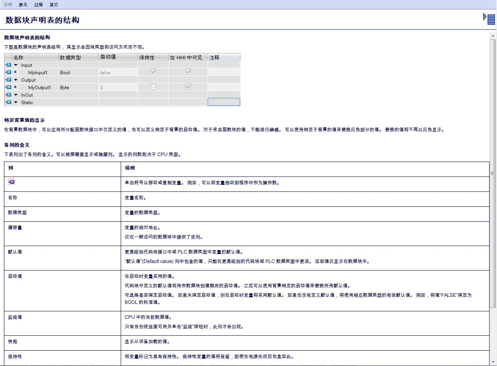
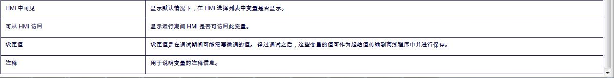
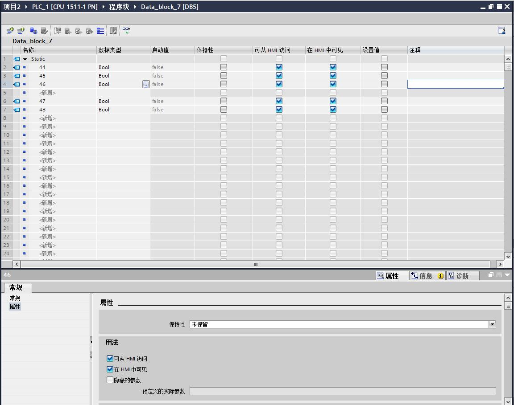

#数据参数
**Note:**数据块 (DB) 用于保存程序执行期间写入的值。 与代码块相比，数据块仅包含变量声明。 不包含任何程序段或指令。 变量声明定义数据块的结构。 

##数据块类型(全局与局部)

有两种类型的数据块：

* 全局数据块

全局数据块不能分配给代码块。 可以从任何代码块访问全局数据块的值。 全局数据块仅包含静态变量。

全局数据块的结构可以任意定义。 在数据块的声明表中，可以声明在全局数据块中要使用的数据元素。 

* 背景数据块

背景数据块可直接分配给函数块 (FB)。 背景数据块的结构不能任意定义，取决于函数块的接口声明。 该背景数据块只包含在该处已声明的那些块参数和变量。 

但，可以在背景数据块中定义实例特定的值，例如，声明变量的起始值。

**注释：**

`其实这里与我们的全局变量和局部变量的含义很相似，我们可以简单的将这两种概念等同。依照这个思路，我们的程序块也是有局部数据，全局数据的。只是，我们的这些数据，不能以块的方式生成而已。`

###ARRAY 数据块 (S7-1500)（）

ARRAY 数据块是包含一个 ARRAY 的全局数据块。 该 ARRAY 可基于任意数据类型。 例如，可以是 PLC 数据类型 (UDT) 的 ARRAY。 但这种数据块不能包含除 ARRAY 之外的其它元素。 由于采用平面结构，ARRAY 数据块可访问 ARRAY 元素，并将这些元素传递给被调用块。

可通过“指令”(Instructions) 任务卡上“移动操作”(Move operations) 部分中的选项，对 ARRAY 数据块进行寻址。 

###PLC 数据类型作为全局数据块的模板 

PLC 数据类型可用于创建具有相同数据结构的全局数据块的模板。 仅需一次创建 PLC 数据类型的结构，然后就可以通过分配 PLC 数据类型生成所需的数据块。 

###系统数据类型作为全局数据块的模板 

系统数据类型也可用于创建具有相同数据结构的全局数据块的模板。 系统数据类型已预定义了结构。 只需在程序中插入系统数据类型一次，之后就可以通过对相同的结构分配系统数据类型来生成其它数据块。

##访问模式

访问数据块中的数据值有两种方式：

* 可优化访问的数据块（仅对 S7-1200）

可优化访问的数据块没有固定的定义结构。 在声明中，仅为数据元素分配一个符号名称，而不分配在块中的固定地址。 可通过符号名访问这些块中的数据值。

ARRAY 数据块中始终启用“优化块访问”(Optimized block access) 属性。 

* 可标准访问的数据块（所有 CPU 系列）

可标准访问的数据块具有固定的结构。 数据元素在声明中分配了一个符号名，并且在块中有固定地址。 可通过符号名或地址访问这些块中的数据值。

ARRAY 数据块不可能进行标准访问。

**注释：**

`综上所述，访问数据的时候，为了处理Array，SIEMENS提供了所谓的优化访问的能力。依照这种理念来看，我们在任何的程序块中都能做到所谓的优化访问。我们所有的数据都可以通过一套固定完整的方法进行寻址。`

##数据值的保持性

要防止在发生电源故障时数据丢失，可以将数据值存储在保持性存储区中。

**注释：**

`这些是静态数据还是动态数据？（应该是动态数据）我们的动态数据保存与恢复已经解决了这个问题，但是并不清楚SIEMENS他们的保存的周期是多长时间。`

##数据块声明表的结构 

下图是数据块的声明表结构， 其显示会因块类型和访问方式而不同。 

以上是西门子介绍的自身的数据表中的内容。下面让我们来一起看一下实例。

* 设置值

是否在调试过程中允许修改改变量的值。
