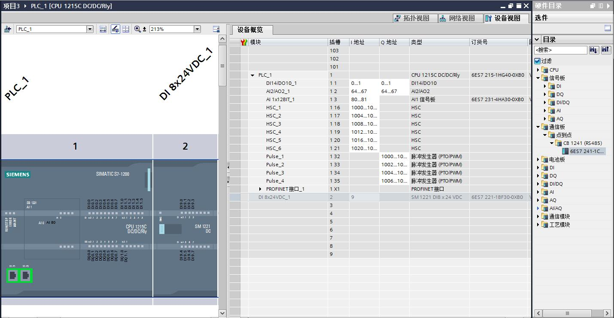
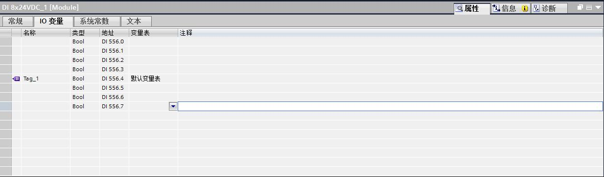
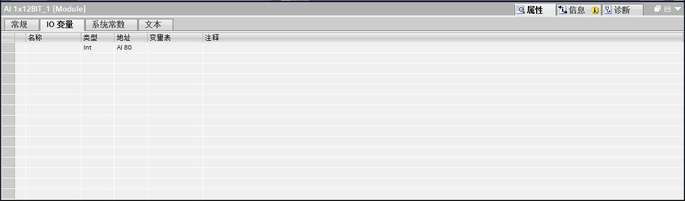
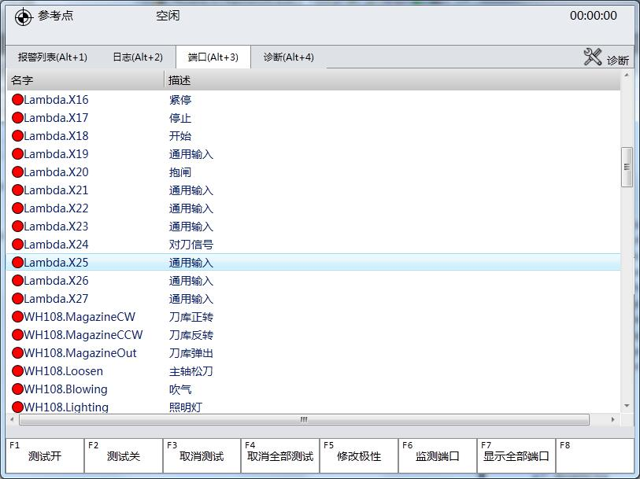

#端口配置
**Note：**本文对西门子I/O模块进行一定的了解。

##端口组成

从图中我们可以看到，西门子的端口组成一般来说分为`DI/DQ/AI/AQ`也就是所谓的数字量输入、输出，模拟量输入、输出。
他的端口是广义上的端口，有很多不同的类型。如图中还提到的HSC，脉冲发生器等等。

* DI 数字量输入

* DQ 数字量输出

* AI 模拟量输入

* AQ 模拟量输出

* HSC 高速计数器

...

##端口概念的不同

我们现在使用的端口概念比较狭义，所以我们的端口列表也比较狭义。我们端口列表仅仅对数字量的输入输出进行了呈现而已。

##端口列表的用途

制作端口列表的初衷，我认为无外乎想通过软件来监视I/O端口的运行状况。这里肯定包括了数字量和模拟量两种。
并且，输入与输出应该是两个分离的控件，能够清晰地看出当前时刻端口的运行情况。瀑布式列表是用来统一管理的，一般情况下不需要出现。
只有有需要的时候弹出。