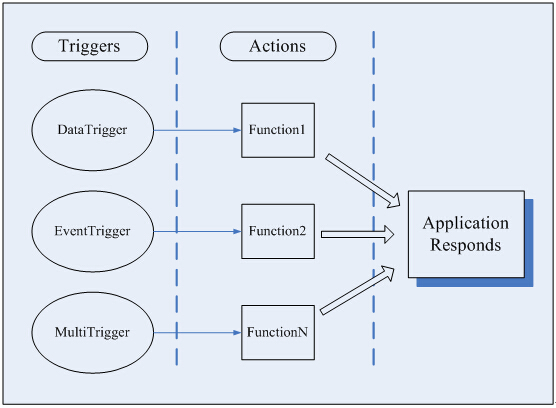

HMI二次开发内容
======================

**NOTE:** 本文简单阐述HMI二次开发内容。

#HMI简介
HMI即Human Machine Interface（人机接口或人机界面）的简称。

如果自己来进行HMI开发，我们会首先关注哪些方面？我想UI开发主要处理的一定包括两个主要层次的内容，一个是`数据展现`，另一个就是`数据操作`，所以UI开发必须能够接收各种不同的数据并通过UI界面展现出来，然后可以通过控件行为来操作这些数据。

UI开发的本质是数据和行为。这的行为是广义的行为，它包括：行为（Behavior）、触发器（Trigger）、操作（Action）。

#数据（Data）
此处的数据包含Pheonix两个容器(G和L)中的地址值。

#数据的载体
控件是数据的载体，它也控制了数据显示的外观。

我们如何使得这些控件和数据关联起来呢?它可以通过行为（Behavior）、触发器（Trigger）、动作（Action)来实现关联。

##行为（Behavior）
每个行为都为元素提供了一个服务，该服务涉及到监听几个不同事件并执行几个相关的操作。它通过绑定(Binding) 和 转换(Converters)来实现。

WPF的数据绑定是一个强大的功能，它允许单向和双向的绑定，当对象更改时UI会自动刷新，当UI操作后数据也可以自动更改。

有时候数据的格式并不只是简单的显示，比如数据的格式化，可以通过一个转换器来实现。

##触发器（Trigger）
触发器是一种对象，该对象侦听特定条件（例如事件触发或属性设置为某个值），并调用一项或多项关联的 Actions 作为响应。常用触发器：DataTrigger、EventTrigger、MultiTrigger。 

##操作（Action)
操作是只能“执行” 某些动作的对象。

