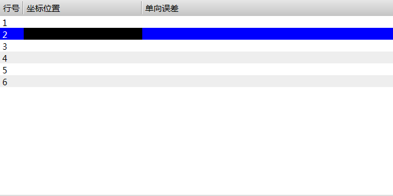

丝杠误差补偿列表
==============================

**NOTE:本文介绍丝杠误差补偿控件** 

##简介

该控件用于配置丝杠误差补偿数据。

##应用

效果图：



步骤一：打开Blend，新建一个工程，添加一个页面，添加UI的动态链接库，然后选择AxisErrorCompensationGrid控件，调整控件位置和大小。

步骤二：配置端口列表内需要显示的列项：行号、坐标位置、正向误差、负向误差。

以下是页面文件内部分代码：

````
<ui:AxisErrorCompensationGrid Index="0" Name="CompAEC" Height="330" VerticalAlignment="Top" Background="White">
            <ui:AxisErrorCompensationGrid.Columns>
                <DataGridTextColumn Width="40" Binding="{Binding Index}" Header="行号" />
                <DataGridTextColumn Width="200" Binding="{Binding Nominal, Converter={StaticResource doubleConverter}}" Header="坐标位置" />
                <DataGridTextColumn Width="200" Binding="{Binding Positive, Converter={StaticResource doubleConverter}}" Header="正向误差" />
                <DataGridTextColumn Width="200" Binding="{Binding Negative, Converter={StaticResource doubleConverter}}" Header="负向误差"/>
            </ui:AxisErrorCompensationGrid.Columns>
</ui:AxisErrorCompensationGrid>
````

##控件属性

###BitPortListView控件继承WPF控件ListView的所有public属性，下表中为自定义的所有public属性：

| :属性名称: | 功能描述  | 属性类型 |
| :----: | -------- | :----: |
| Apply | 设置一个值，该值指定是否应用列表中的丝杠误差补偿数据。 | bool |
| Check | 获取一个值，该值检查当前列表内的数据配置结果。 | string |
| Count | 设置一个值，该值指定丝杠误差补偿的测量点数。 | number |
| Index | 设置一个值，该值指定物理轴的序号。 | string |
| Delete | 设置一个值，该值指定是否删除当前选中行。 | bool |
| DeleteAll | 设置一个值，该值指定是否删除列表中所有行。 | bool |
| FilePath | 设置一个值，该值指定导入导出的目标路径。 | string |
| Import | 设置一个值，该值指定是否导入目标路径内的数据。 | bool |
| Insert | 设置一个值，该值指定是否在选中行之前插入一行。 | bool |
| LineCount | 获取一个值，该值指示列表中的行数。 | number |
| Output | 设置一个值，该值指定是否将数据导出到目标路径。 | bool |
| SetParameters | 设置一个值，该值指定是否计算和生成丝杠误差补偿数据。该数据是将根据起点位置、间隔距离和测量点数计算而来。 | bool |
| Start | 设置一个值，该值指定丝杠误差补偿的起点位置。 | number |
| Step | 设置一个值，该值指定丝杠误差补偿的间隔距离。 | number |

