简单界面的实现
======================

**NOTE:** 本文在平台基础上，画一个简单的页面。

#Script
1.什么是页面、对话框、控件？

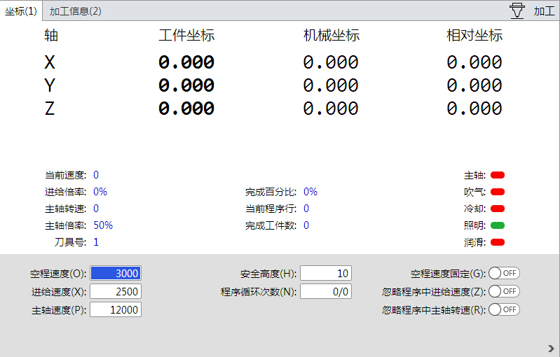
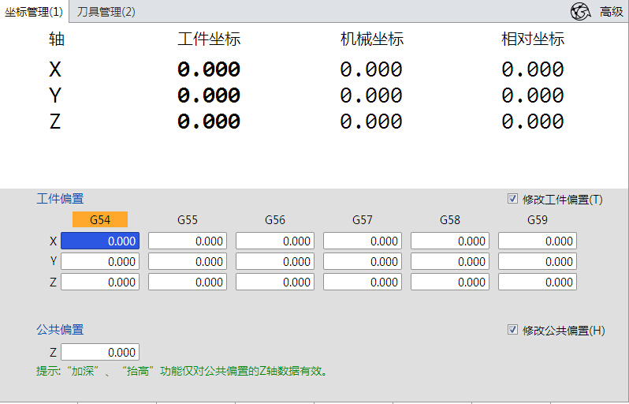
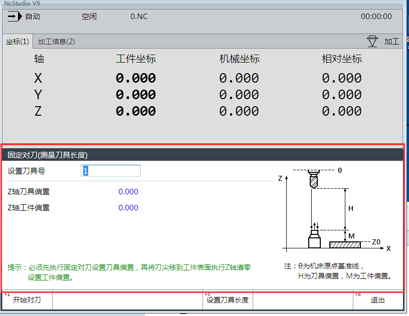
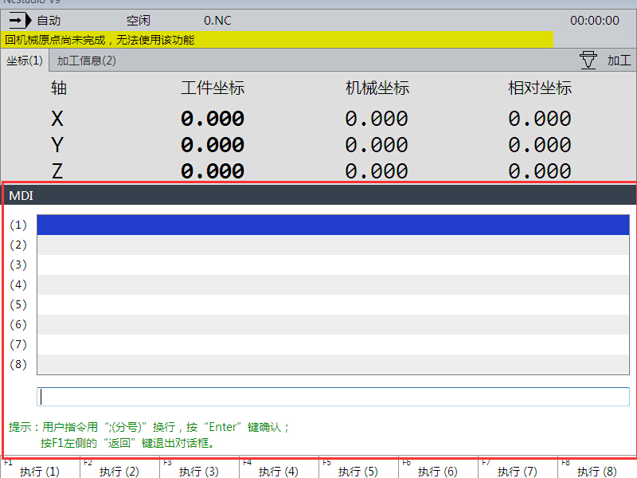
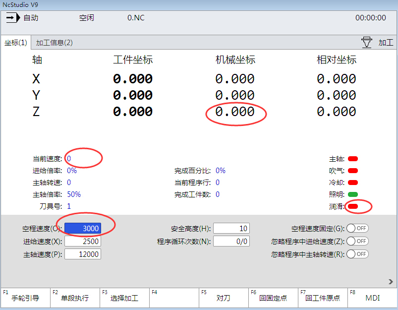

2.NK300和V8怎么来的？
Phoenix平台有了，但是怎么才能有NK300BX、V8等软件产品呢。

首先我们将NK300和V8抽象，抽象的是就是页面+菜单

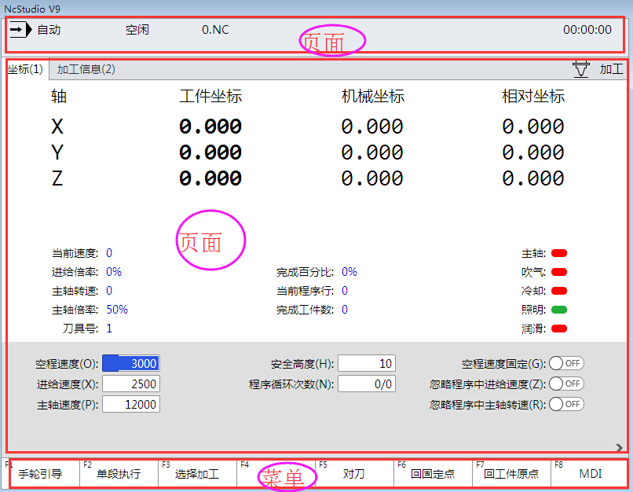
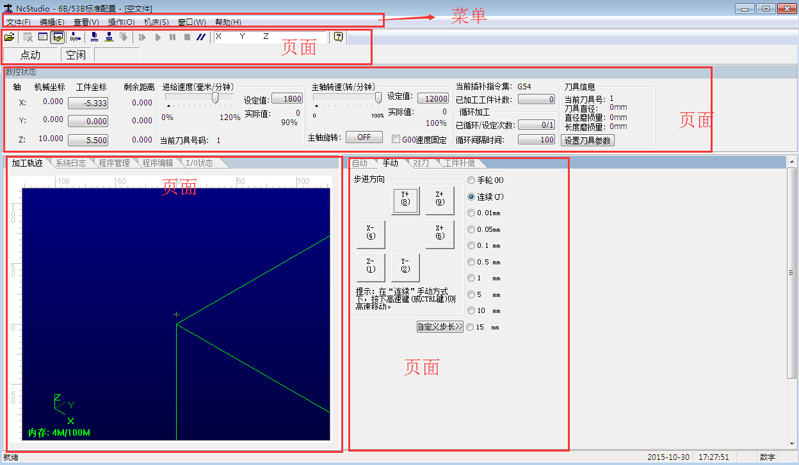

3.实现一个简单的页面

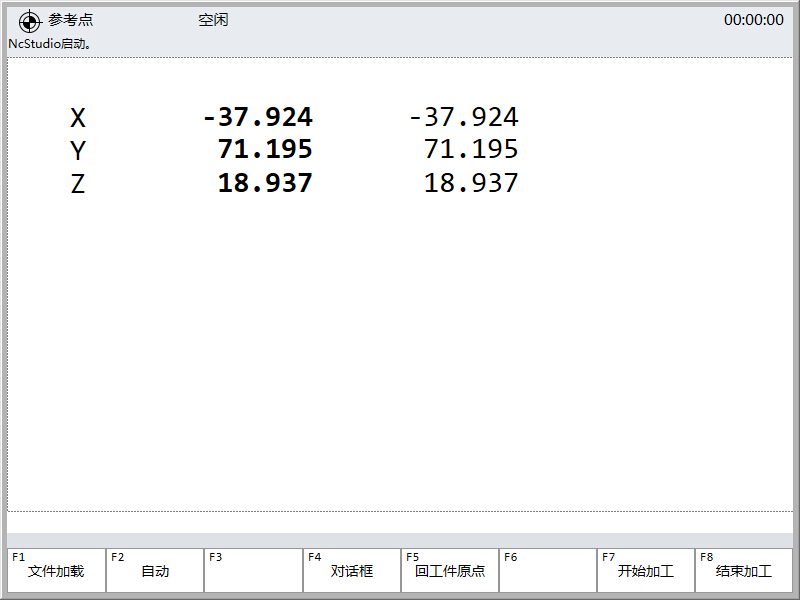

第一步：先了解下资源存放的地方Frames

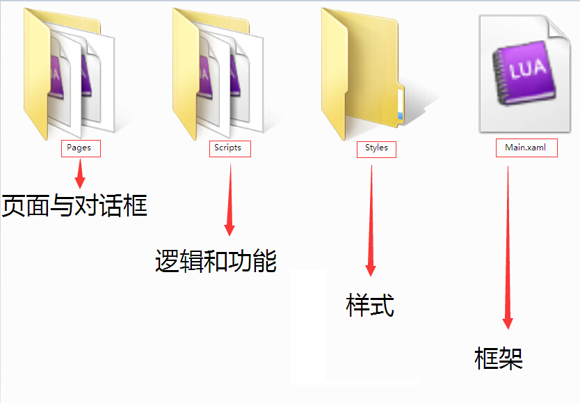

Frame这个文件夹下面有三个文件夹和一个Main.xml文件

第二步：准备材料，先画一个空界面

可以利用Blend画图，也可以通过写脚本画图。
简单配置了引用的资源库和页面的大小、背景色。页面文件放在Frame\Pages文件夹下
<UserControl xmlns="http://schemas.microsoft.com/winfx/2006/xaml/presentation"
             xmlns:x="http://schemas.microsoft.com/winfx/2006/xaml"
             xmlns:i="clr-namespace:System.Windows.Interactivity;assembly=System.Windows.Interactivity"
             xmlns:ui="http://weihong.phoenix.ui.interactions"
             xmlns:ei="clr-namespace:Microsoft.Expression.Interactivity.Core;assembly=Microsoft.Expression.Interactions"
             Background="{DynamicResource ContainerBackground}">
</UserControl>

第二步：搭框架。
页面有了，那就赶紧把基本的框架搭起来吧。
````
<Window xmlns="http://schemas.microsoft.com/winfx/2006/xaml/presentation"
        xmlns:x="http://schemas.microsoft.com/winfx/2006/xaml"
        xmlns:ui="http://weihong.phoenix.ui.interactions"
        xmlns:i="clr-namespace:System.Windows.Interactivity;assembly=System.Windows.Interactivity"
        xmlns:ei="clr-namespace:Microsoft.Expression.Interactivity.Core;assembly=Microsoft.Expression.Interactions"
        Title="NcStudio" Height="600" Width="800" Name="Main" WindowStyle="None">
    <DockPanel>
        <ui:FMenu Count="8" Path="Frames\\Menus\\FMenu.lua" Height="60" DockPanel.Dock="Bottom" />
		<DockPanel Height="520" DockPanel.Dock="Top">
            <ui:XPage Name="CoorAutoPage" Menu="Menu_Auto" Path="Frames\\Pages\\CoorAutoPage.xaml"/>
        </DockPanel>
    </DockPanel>
</Window>
````

FMenu：

Count:配置F菜单项的个数

Path：配置指定菜单内容的存放位置

XPage：

Name：页面的名字

Menu：页面对应的菜单项

Path：页面资源的地址

看一下效果吧

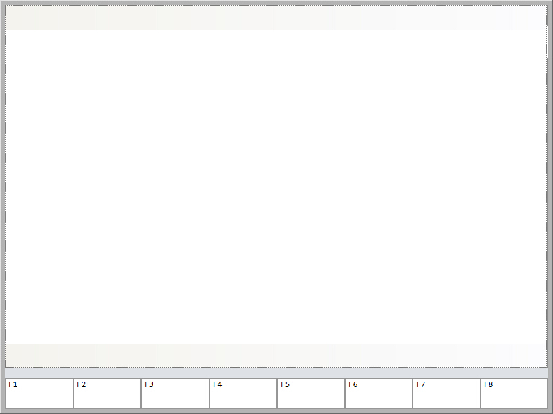

也许大家觉得一片空白，看不出效果，那就开始我们完善之旅吧。

第三步：内容丰富

让我们理一下思路：要实现一个简单的加工，我们需要准备什么

1.文件装载

2.坐标显示

页面：添加坐标显示的控件

利用Blend，添加TextBlock，用于显示X轴的工件坐标值

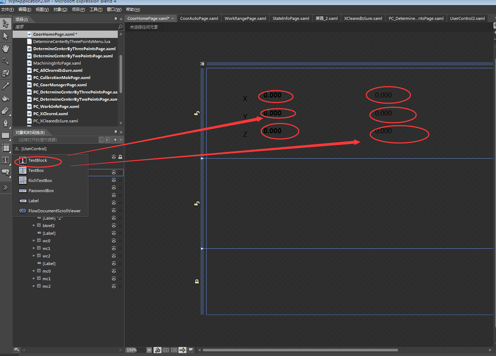

页面文件就生成了，现在需要要让数据反馈到控件上，这时，数据绑定的概念产生了。
数据绑定是指内部的数据信息通过某方法实现与控件显示属性进行链接。
此处的绑定方法有操作、行为、触发器。

我们为刚才添加的TextBlock添加一个行为。
````
<i:Interaction.Behaviors>
	<ui:DynamicBindingBehavior Path="Phoenix.G.Channels[0].Axes[0].WorkCoor" UpdateInterval="100" Property="Text" StringFormat="{}{0:F3}"/>
</i:Interaction.Behaviors>
````
重复下前面的操作，添加完成X、Y、Z轴的工件坐标和机械坐标。

看下效果图

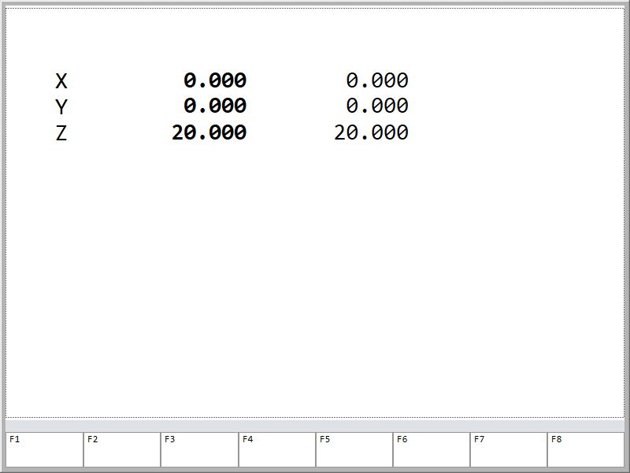

依照上述的方法，我们添加了文件装载的页面。
接下来丰富下菜单。
菜单内可以实现一些逻辑，我们在Scripts文件夹中FMenu.lua中进行配置与页面对应的菜单。
````
Menu_Auto={
    F1=Item_FileLoadPage,
	F2={
        Text = "模式切换",
	    State = function() 
	    
	    end,
        
		F1 = Item_AutoMode,
		F2 = Item_HomeMode,
	};
	F3={
        Text = "回参考点",
	    State = function() 
	    
	    end,
        
        F1={
			Text = "机械原点",
			State = function() 
	    
			end,
			F1 = Item_Homed,
			F2 = Item_CancelHomed,
		};
	};
	F4=Item_Calibration,
	F5=Item_BackToCoorOrigin,
	F7=Item_Start,
	F8=Item_Stop,
};
````
每个子菜单中可以实现不同的逻辑。
````
Item_Start = {
	Text = "开始加工",
	State = function()
	end,
	Action = function()
			Phoenix.G.Channels[0].Auto.StartOrContinue = true
	end
};
````
Text：子菜单显示的名字

State：控制按钮的状态

Action：执行

我们给上述每一个子菜单实现一定的逻辑。

````
<ui:XPage Name="CoorAutoPage" Menu="Menu_Auto" Path="Frames\\Pages\\CoorAutoPage.xaml"/>
````

最终为大家展现的是这样的效果。


