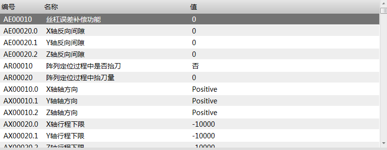

参数列表
==============================

**NOTE:本文介绍参数列表控件** 

##简介

该控件用于显示和设置所有参数。

##应用

在本实例中，有一个参数“Y轴精定位阶段速度”需要在参数列表中显示。

效果图：



步骤一：打开Blend，新建一个工程，添加一个页面，添加UI的动态链接库，然后选择ParameterView控件，调整控件位置和大小。

步骤二：配置参数列表内需要显示的列项。

步骤三：在参数表中新增参数。

步骤四：配置参数列表的参数表、需要显示的参数类型、需要显示的参数等级。

以下是页面文件内部分代码：

````
<ui:ParameterView Name="dl" 
    VirtualizingStackPanel.IsVirtualizing="True" 
    VirtualizingStackPanel.VirtualizationMode="Recycling" 
    Grid.Row="0"
    Width="820"
    Height="326"
    DataFilter="{x:Null}"
    LevelFilter = "Operator"
    LuaPath="Parameters">
    <i:Interaction.Behaviors>
        <ui:SelectorFocusBehavior/>
    </i:Interaction.Behaviors>
    <ui:ParameterView.View>
        <GridView AllowsColumnReorder="true" ColumnHeaderToolTip="ParameterView" ColumnHeaderContainerStyle="{DynamicResource NormalGridViewColumnHeaderStyle}">
             <GridViewColumn Width="88"
                             DisplayMemberBinding="{Binding Path=Number}"
                             Header="{ia:L 编号}" />
             <GridViewColumn Width="300"
                             DisplayMemberBinding="{Binding Path=Name}"
                             Header="{ia:L 名称}" />
             <GridViewColumn Width="400"
                             DisplayMemberBinding="{Binding Path=DisplayValue}"
                             Header="{ia:L 值}" />
        </GridView>
    </ui:ParameterView.View>
</ui:ParameterView>
````

以下是参数表的代码：

````
function LimitCheck_LEAndGE(p,n_minequal,n_maxequal)
	if type(n_minequal) ~= "number" or type(n_maxequal) ~= "number" then
		return false,"输入的值不是数值类型"
	end
	if p < n_minequal or p > n_maxequal then
		local str = "值应该在["..n_minequal..","..n_maxequal.."]之间"
		return false, str
	end
	return true
end

Parameters={
	["Phoenix.L.Channels[0].ChannelAxes[1].Axis.BackRef.BkrefF2"] = {
			  	Name = "Y轴精定位阶段速度",
	            Desc = "在回机械原点过程中，精定位阶段的运动速度",
	           	Level = "Operator",
	           	Category = "Reference",
	            Number = "BH00090.1",
				Unit = "mm/min",
				Multiple = 60, 
				Format = "%f3",
			    Check = function(p) 
					local minequal = 0.001
					local maxequal = 10000
					return LimitCheck_LEAndGE(p,minequal,maxequal)
	            end,
				Condition = function CanEdit()
                    local state = Phoenix.G.Channels[0].State
                    if state == "Idle" then
                        return true
                    end
                    msg = "当前不处于空闲状态不能进行参数修改"
                    return false,msg
               end,
        };
}
````

##控件属性

###ParameterView控件继承WPF控件ListView的所有public属性，下表中为自定义的所有public属性：

| 属性名称   | 功能描述  | 属性类型 |
| :---- |:-------- | :---- |
| DataFilter | 获取或设置一个值，该值可以根据参数的分类筛选数据。 | String |
| LevelFilter | 获取或设置一个值，该值可以根据参数的权限筛选数据。 | String |
| LuaPath | 获取或设置一个值，该值指定了参数源所在根表的表名。 | String |

注：若不进行筛选，则将空字符串(`""`)赋给筛选值。

如：Phoenix.G.UI.MachineAndControlParameterPage.Elements.dl.DataFilter = ""
Phoenix.G.UI.MachineAndControlParameterPage.Elements.dl.LevelFilter = ""

###ParameterView列表控件中用于视图显示的属性

| 属性名称 | 功能 | 属性类型 |
| :----: |:--------:| :----: |
| Category | 参数分类 | String |
| DisplayValue | 参数值 | String |
| Level | 参数权限 | String |
| Multiple | 倍乘 | String |
| Name | 参数名称 | String |
| Number | 参数编号 | String |
| Unit | 参数单位（选配） | String |

###参数的属性

| 属性名称   | 功能描述  | 属性类型 |
| :----: |:--------:| :----: |
| Category   | 设置参数类别，用于对参数进行归类。 | string |
| Check   | 检测设置的参数值是否合理。若合理，则返回true；不合理，则返回false和参数不合理的提示信息。  | function |
| Condition   | 控制参数是否允许编辑。若不允许编辑，则返回false和提示信息；若允许，则返回true。 | function |
| Desc   | 参数描述 | string |
| Format    |  格式化参数值。目前只运用于类型为number的数据，其他类型的值，该属性不设置。 | string |
| Level   | 设置参数等级 | string |
| Multiple  |  倍乘。单位换算系数。 | number |
| Name   | 参数名  | string |
| Number   |  设置参数编号 | string |
| Unit    |  参数值的单位 |  string |