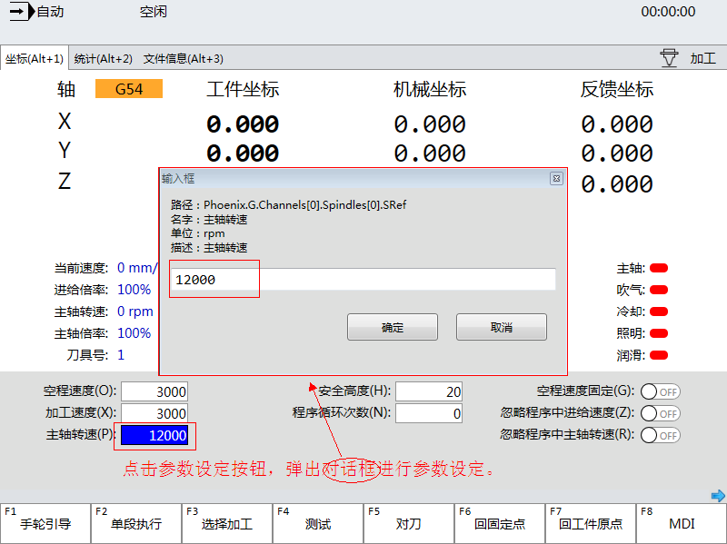

参数设置按钮
==============================

**NOTE:本文介绍自定义参数设置按钮。** 

##简介

ParameterButton用于单个参数的设定。

##应用

在本实例中，在页面上添加一个“设定主轴转速”的参数设置控件。

如图所示：



以下是参数设置按钮控件的代码：
````
<ui:ParameterButton Name="proSpRef"
                    Width="74"
                    Height="22"
                    LuaPath="Parameters['Phoenix.G.Channels[0].Spindles[0].SRef']">
</ui:ParameterButton>
````

##属性
| 属性                | 描述                   |
| ------------------- |:---------------------|
| LuaPath             | 指定参数的信息表    |
