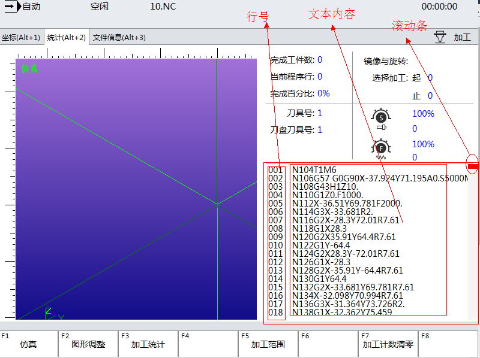

当前加工程序行控件CurrentFileView
==============================

**NOTE:本文介绍当前加工程序行控件** 

##简介

当前加工程序行控件可以读取并跟踪机器正在执行的加工程序。

##应用

在本实例中，在画面中添加当前加工程序行控件。操作员可以对特定格式的加工文件进行读取。

如图所示:



以下是当前加工程序行控件的代码:
````
<nc:CurrentFileView Name="CUR" Width="345" Height="255" Style="{StaticResource CurrentNcCodeStyle}">
    <i:Interaction.Behaviors>
        <ui:DynamicBindingBehavior Path="Phoenix.G.Channels[0].Auto.FileInfo.TargetFilePath" Property="FilePath" UpdateInterval="100" />
        <ui:DynamicBindingBehavior Path="Phoenix.G.Channels[0].Auto.Statistic.CurrentLineNo"  Property="CurrentLineNo" UpdateInterval="100"/>
        <ui:DynamicBindingBehavior Path="Phoenix.G.Channels[0].Auto.FileInfo.TotalLineCount"  Property="FileTotalLineNo" UpdateInterval="100"/>
    </i:Interaction.Behaviors>
</nc:CurrentFileView>
````

##当前加工程序行控件属性
| 属性   | 描述    | 值类型 |
| :---- |:--------|:--------|
| CurrentLineNo    | 获取或设置一个值，该值指定加工过程中当前正在执行的行号。   | number |
| FilePath    | 获取或设置一个值，该值指定加工文件的绝对路径。 | string |
| FileTotalLineNo   | 获取一个值，该值指示当前加载文件的总行号。     | number |