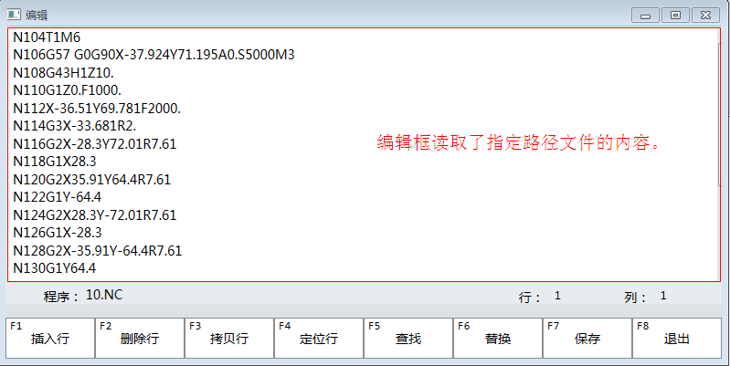

文本编辑框EditFileTextBox
==============================

**NOTE:本文介绍文本编辑框EditFileTextBox** 

##简介

文本编辑框可以读取并显示指定路径文本文件。

##应用

在本实例中，在画面中新建一个编辑页面。操作员可以对选中的特定格式的加工文件进行读取和编辑。

如图所示：



以下是文本编辑框的代码:
````
<nc:EditFileTextBox x:Name="EditTextBox" 
					Height="282"  
					AcceptsReturn="True"  
					FontSize="14" 
					VerticalScrollBarVisibility="Auto" 
					HorizontalScrollBarVisibility="Auto">
   <FlowDocument LineHeight="1"/>
   <i:Interaction.Behaviors>
       <ui:DynamicBindingBehavior Path="Phoenix.L.EditFile.EditPath" Property="Path"/>
   </i:Interaction.Behaviors>
</nc:EditFileTextBox>
````

##文本编辑框属性
| 属性   | 描述    | 值类型 |
| :---- |:--------|:--------|
| AcceptsReturn  | 设置一个值，该值指定回车键是否有效。   | bool |
| Clear    | 设置一个值，该值指定是否执行“清除文内框内容”操作。   | bool |
| ColumnNo   | 获取一个值，该值为文件内容中焦点所在的列号。     | number |
| Copy    | 设置一个值，该值指定是否执行“复制”操作。   | bool |
| CopyLine   | 设置一个值，该值指定是否执行“复制粘贴行”操作。 | bool |
| Cut    | 设置一个值，该值指定是否执行“剪切”操作。   | bool |
| DeleteLine   | 设置一个值，该值指定是否执行“删除行”操作。  | bool |
| ExitEdit    | 设置一个值，该值指定是否执行“离开编辑”操作。  | bool |
| FileName   | 获取一个值，该值为正在编辑文件的文件名。     | string |
| Find    | 设置一个值，该值指定是否执行“查找”操作。   | bool |
| FindString    | 设置一个值，该值指定“待查找的字符串”。  | string |
| InsertLine   | 设置一个值，该值指定是否执行“插入行”操作。  | bool |
| IsTextChanged | 获取一个值，该值指示文件是否被修改。 | bool |
| LineNo    | 获取一个值，该值为文件内容中焦点所在的行号。 | number |
| Paste    | 设置一个值，该值指定是否执行“粘贴”操作。   | bool |
| Path    | 设置一个值，该值指定待打开文件完整的绝对路径。   | string |
| PositionLine   | 设置一个值，该值指定是否执行“定位行”操作。 | bool |
| PositionLineNo   | 设置一个值，该值指定“定位行行号”。 | number |
| ReplaceString | 设置一个值，该值指定“待替换的字符串”。 | string |
| ReplaceStart    | 设置一个值，该值指定是否执行“替换”操作。   | bool |
| SaveFile    | 设置一个值，该值指定是否执行“保存”操作。   | bool |
| SaveAsPath    | 设置一个值，该值指定文件另存为路径。  | string |
| SaveFileAs    | 设置一个值，该值指定是否执行“另存为”操作。   | bool |
| SelectAll    | 设置一个值，该值指定是否执行“全选”操作。   | bool |
| TotalLineCount   | 获取一个值，该值为文件的总行号。 | number |
| Undo    | 设置一个值，该值指定是否执行“撤销”操作。   | bool |