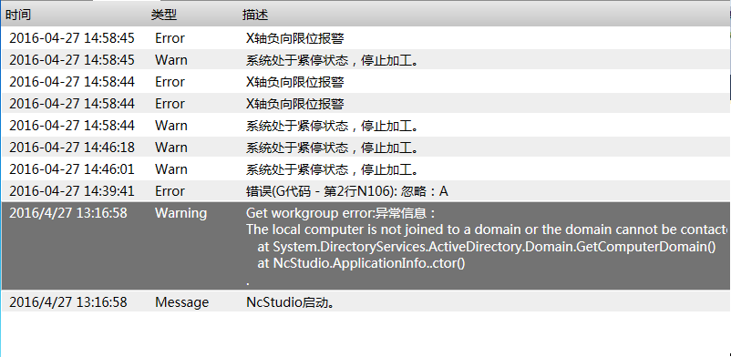

日志列表
==============================

**NOTE:本文介绍日志列表控件** 

##简介

该控件用于显示日志信息。

##应用

在本实例中，需要添加一个日志页面，用于查看生产过程中的日志内容。

效果图：



步骤一：打开Blend，新建一个工程，添加一个页面，添加UI的动态链接库，然后选择LogView控件，调整控件位置和大小。

步骤三：配置日志列表控件内需要显示的列项：创建时间、日志类型、日志内容。

以下是页面文件内部分代码：

````
<ui:LogView Name="Logs"
            SelectedIndex = "0"
	    	DefaultTypes="Message,Warn,Error,WarnHold,ErrorHold,TimeWarning" 
            Margin="0,0,0,70" 
            ScrollViewer.HorizontalScrollBarVisibility="Hidden">
	    	<ui:LogView.View>
                <GridView ColumnHeaderContainerStyle="{DynamicResource NormalGridViewColumnHeaderStyle}">
	            	<GridViewColumn Header="{ia:L 时间}" Width="160" DisplayMemberBinding="{Binding Path=CreateTime}"/>
	            	<GridViewColumn Header="{ia:L 类型}" Width="100" DisplayMemberBinding="{Binding Path=Flag}"/>
					<GridViewColumn Header="{ia:L 描述}" Width="540" DisplayMemberBinding="{Binding Path=Text}"/>
	        	</GridView>
	    	</ui:LogView.View>
</ui:LogView>
````

##控件属性

###LogView控件继承WPF控件ListView的所有public属性，下表中为自定义的所有public属性：

| 属性名称   | 功能描述  | 属性类型 |
| :----|:--------| :---- |
| Clean | 设置一个值，该值实现清除此时在日志列表中显示的日志内容。 | bool |
| CheckingTypes | 设置一个值，该值指定检查的日志类型。 | string |
| DefaultTypes | 获取或设置一个值，该值定义在列表中所有可以显示的日志类型。 | string |
| ExchangedFilter | 设置一个值，该值指定筛选的日志类型。 | string |
| IsHistory | 设置一个值，该值指示在日志列表中是否显示历史日志。 | bool |
| IsShown | 获取一个值，该值指示筛选的日志类型是否与检查的日志类型一致。 | bool |


| 属性名称   | 功能描述  | 属性类型 |
| :---- |:--------| :---- |
| CreateTime | 日志创建时间 | String |
| Flag | 日志类型 | String |
| Text | 日志内容 | String |
