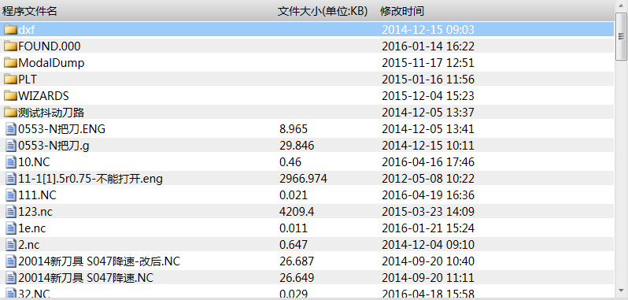

本地盘文件列表FileListView
==============================

**NOTE:本文介绍本地盘文件列表控件FileListView** 

##简介

FileListView控件用于访问本地磁盘中自定义路径下的文件与文件夹，包含子文件和子文件夹。

##应用

在本实例中，需要访问本地磁盘D盘下NcFile内的所有的文件。

效果图：



步骤一：打开Blend，新建一个工程，添加一个页面，添加UI的动态链接库，然后选择FileListView控件，调整控件位置和大小。

步骤二：配置端口列表内需要显示的列项：文件或文件夹的名称、文件的大小、修改的时间。

以下是页面文件内部分代码：

````
 <nc:LocalFileList Name="FileListView" 
     BorderThickness="0" 
     VirtualizingStackPanel.IsVirtualizing="True" 
     VirtualizingStackPanel.VirtualizationMode="Recycling"  
     Style="{DynamicResource ListViewStyleOfGridView}"  
     FontSize="14"  
     Filter="*.g|*.eng|*.dxf|*.nc|*.plt|"  
     Directory="D:\NcFiles"  
     Width="795" 
     Height="340" 
     Background="White" >
            <nc:LocalFileList.View>
                <GridView ColumnHeaderContainerStyle="{DynamicResource NormalGridViewColumnHeaderStyle}">
                    <GridViewColumn Width="350" 
                                    CellTemplate="{StaticResource FileNameTemplate}"
                                    Header="{ia:L 程序文件名}" />
                    <GridViewColumn Width="130"
                                    DisplayMemberBinding="{Binding Path=FileSize}"
                                    Header="{ia:L 文件大小(单位:KB)}" />
                    <GridViewColumn Width="300"
                                    DisplayMemberBinding="{Binding Path=ModifyTime}"
                                    Header="{ia:L 修改时间}" />
                </GridView>
            </nc:LocalFileList.View>
</nc:LocalFileList>
````

##控件属性

###LocalFileList控件继承WPF控件ListView的所有public属性，下表中为自定义的所有public属性：

| 属性名称   | 功能描述  | 属性类型 |
| :---- | :-------- | :---- |
| CurrentItemPath | 获取一个值，该值指示当前选中项的绝对路径。 | string |
| CurrenItemFileType | 获取一个值，该值指示当前选中项的类型。 | string |
| CurrenItemName | 获取一个值，该值指示当前选中项的名称。 | string |
| GotoRoot | 设置一个值，该值设置是否退回上一级目录。 | bool |
| GotoFolder | 设置一个值，该值设置是否进入下一级目录。 | bool |
| Directory | 设置一个值，该值预定义本地磁盘下需要浏览文件的路径。 | string |
| Filter | 设置一个值，该值指定文件列表内显示的文件类型。 | string |
| RootDirectory | 获取一个值，该值指示文件列表控件预定义配置的磁盘路径。 | string |


###LocalFileList列表控件中用于视图显示的属性（LocalFileList.View的属性）

| 属性名称 | 功能 | 属性类型 |
| :---- | :-------- | :---- |
| Name | 文件或文件夹的名称 | String |
| FileSize | 文件大小，对文件夹无效 | String |
| ModifyTime | 文件或文件夹修改时间 | String |
