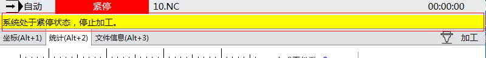

消息提示控件LogBar
==============================

**NOTE:本文介绍消息提示控件LogBar** 

##简介

消息提示控件LogBar用于显示生产过程中出现的信息、警告和错误。

##应用

在本实例中，在画面中添加消息提示控件。可以作为日志的快键显示。

如图所示：



以下是消息提示控件的代码：

````
<ui:LogBar Height="23" Width="799" Canvas.Left="1" Canvas.Top="27">
    <ui:LogBar.ViewScopes>
        <ui:ViewScope Flag="Error"
	        Foreground="White"
          	Background="Red"
            MinTime="1"
	        DefaultTime="5" />
        <ui:ViewScope Flag="Message"
	        Foreground="Black"
          	Background="{DynamicResource E8ECF0ColorBrush}"
            MinTime="0.1"
	        DefaultTime="4" />
        <ui:ViewScope Flag="Warn"
	        Foreground="Black"
          	Background="Yellow"
            MinTime="0.1"
	        DefaultTime="3" />
        <ui:ViewScope Flag="TimeWarning"
	        Foreground="Black"
          	Background="Yellow"
            MinTime="0.1"
	        DefaultTime="31536000" />
        </ui:LogBar.ViewScopes>
</ui:LogBar>
````

##消息提示控件属性
| 属性名称   | 功能描述    |
| :---- |:-------- |
| ViewScopes | 用于定义显示规则   |

##规则的属性
| 属性名称   | 功能描述    |
| :---- |:--------|
| Background   | 背景色   |
| DefaultTime  | 预期显示时间（单位：s）  |
| Flag   | 配置当期需要显示的日志标记   |
| Foreground   | 前景色   |
| MinTime   | 最短显示时间（单位：s）    |


注意：
假设配置了标记为Warning日志，它的最短显示时间为T1，预期显示时间为T2。T0时间产生了第一条日志，若在T0+T1时件内又产生了日志，那么第一条的日志显示时间为T1。如果超出T0+T1时间，但在T0+T2时间之内产生产生第二天日志，那么第一条日志就在第二条日志产生时结束显示。如果第二条日志产生的时间在T+T2时间之外，那么第一条日志显示时间为T2。
