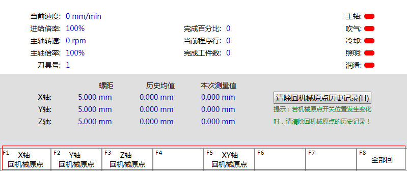

状态反馈按钮ScriptButton
==============================

**NOTE:本文介绍状态反馈按钮。** 

##简介

状态反馈按钮可以向用户反馈当前按钮的状态。

##应用

在本实例中，在画面中创建一个“仿真”按钮。 操作员按下该功能键时，将使软件进行仿真操作。

````
<ui:ScriptButton 
	Height="46" 
	Width="46" 
	Image="{ui:PathBinding Frames\\Pages\\Resources\\仿真.png}" 
	ScriptPath = "Scripts.Simuation_Operation.Button_Simuation" 
	Style="{StaticResource ScriptButtonImageStyle}">
</ui:ScriptButton>
````

````
Scripts.Simuation_Operation = {
	Button_Simuation = 
	{
		Text = "仿真",
		State = function ()
			local mode = Phoenix.G.Channels.Mode
			local state = Phoenix.G.Channels.state
			if mode == "Simu" and state == "Running" then
				return CHECKED
			end
			return ENABLED
		end,
		Action = function ()
			Phoenix.G.Channels[0].Auto.Simu.Start = true
		end,
	},
},
````


##状态反馈按钮控件属性
| 属性   | 描述    |
| :---- |:-------- |
| Image   | 指定按钮上显示的图片   |
| ScriptPath | 指定一个Lua表 |  
| Style   | 设置样式     |

ScriptPath调用的功能表中有三个属性：

| 属性   | 描述    |
| :---- |:------- |
| Text    | 按钮   |
| State    | 反馈按钮当前的状态 |  
| Action   | 执行的动作     |

反馈状态的取值表：

| State值   | 描述    |
| :---- |:-------- |
| ENABLED  | 按钮有效 |
| CHECKED  | 按下状态 |  
| DISABLED | 按钮无效 |

##扩展

FMenu控件与ScriptMenu控件树形的菜单，但在外观呈现上不同。

下图是FMenu：



下图是ScriptButton：


FMenu需要配置菜单按钮的数目。

ScriptButton需要指定菜单数据表的表名。