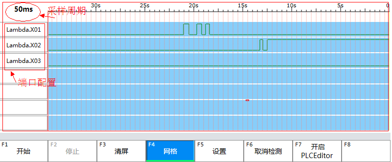

端口信号量检测控件
==============================

**NOTE:本文介绍端口信号量检测控件** 

##简介

该控件用于检测端口的开关量状态。

##应用

在本实例中，在画面中添加端口信号量检测控件。

如图所示：



以下是控件在xaml文件中的部分代码：

````
<ui:BinaryDiagnosticControl 
    Name="bdcDiagnostic" 
    SupportedCount="7" 
    IsGridShow="true" 
    SampleInterval="50" 
    LuaPath="Diagnostic" 
    Margin="0,190,20,0" />
````
LuaPath属性设置的值“Diagnostic”，该值与L表中的数据表名保持一致。该表中需要再添加两张表BinaryPathes和ParaTable。

BinaryPathes表预定义了多个元素，软件启动的时候会进行读取，将配置的开关量端口显示在控件中。软件运行过程中，若修改了待监测端口，端口地址会保存在这个数据表中。

ParaTable表定义了端口地址所对应寻址的名称和描述。

备注：BinaryPathes和ParaTable两张表的名称和格式是固定的。两张表所在的根表（此处是Diagnostic）名字可以更改。根表需要存放在Moudle表内。

Module表所在的文件必须存放在Config下对应的配置文件中。

以下是LuaPath值Diagnostic对应的部分代码：

````
Modules ={
    Diagnostic = 
    {
        BinaryPathes =
        {
            [0] = "Phoenix.G.Lambda.X01",
            [1] = "Phoenix.G.Lambda.X02",
            [2] = "Phoenix.G.Lambda.X03",
            [3] = "",
            [4] = "",
            [5] = "",
            [6] = "",
            [7] = "",
            [8] = "",
            [9] = "",
        };
        ParaTable = 
        {
            Name = "监测",
            Desc = "请输入要监测端口的路径",
        };
    };
};
````

##端口信号量检测控件属性
| 属性名称   | 功能描述  | 值类型 |
| :----: |:--------:| :----: |
| AddItem | 设置一个值，该值指定是否执行“添加一个采样端口”操作。  | Bool |
| Cancel | 设置一个值，该值指定是否执行“清空选中的采样端口”操作。  | Bool |
| Clean | 设置一个值，该值指定是否执行“清除采样轨迹”操作。  | Bool |
| IsGridShow | 设置一个值，该值控制是否显示网格。  | Bool |
| LuaPath | 设置一个值，该值指定预定义的采样端口。  | String |
| SampleInterval | 设置一个值，该值指定“采样周期”。  | Double |
| SampleEnabled | 设置一个值，该值指定是否执行“采样”操作。  | Bool |
| SupportedCount | 设置或获取一个值，该值指定控件最大采样端口数。  | Int |
 