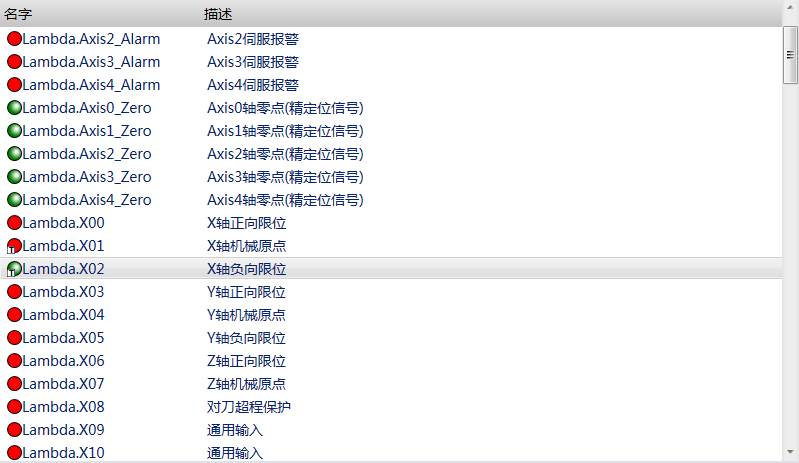

端口列表
==============================

**NOTE:本文介绍端口列表控件** 

##简介

该控件用于显示或设置端口信息。

##应用

在本实例中，需要显示一个输入和一个输出端口，包含端口地址和端口描述。

效果图：



步骤一：准备端口列表需要的数据源。在指定的位置添加端口信息。

步骤二：打开Blend，新建一个工程，添加一个页面，添加UI的动态链接库，然后选择BitPortListView控件，调整控件位置和大小。

步骤三：配置端口列表内需要显示的列项：端口地址和端口描述。

以下是页面文件内部分代码：

````
<ui:BitPortListView x:Name="listView"  VirtualizingStackPanel.IsVirtualizing="True" VirtualizingStackPanel.VirtualizationMode="Recycling"                         
                            Grid.Row="0"
                            Interval="200"
                            LuaPath="BitPort"
                            SelectedIndex="0"
                            Style="{StaticResource ListViewStyle}"
                            ItemContainerStyle="{StaticResource ListViewContainerStyle}"
							ScrollViewer.HorizontalScrollBarVisibility="Hidden">
            <i:Interaction.Behaviors>
                <ui:SelectorFocusBehavior/>
            </i:Interaction.Behaviors>
            <ListView.View>
                <GridView ColumnHeaderContainerStyle="{DynamicResource NormalGridViewColumnHeaderStyle}">
                    <GridViewColumn Width="200" Header="{ia:L 名字}" CellTemplate="{StaticResource ListViewCellItem}">
                    </GridViewColumn>
                    <GridViewColumn Width="600"
                                    DisplayMemberBinding="{Binding Path=Desc}"
                                    Header="{ia:L 描述}">
                    </GridViewColumn>
                </GridView>
            </ListView.View>
        </ui:BitPortListView>
````

以下是端口数据源信息的代码：

````
BitPort={
	InBitPort={
		{
			Path="Lambda.Axis0_Alarm",
			Desc=L("Axis0伺服报警"),
			Polarity = "NO",
		},
	};
	OutBitPort=
	{
		{
			Path="Lambda.Axis0_Enable",
			Desc=(L("Axis0轴使能")),
		},
	};
}
````

##控件属性

###BitPortListView控件继承WPF控件ListView的所有public属性，下表中为自定义的所有public属性：

| 属性名称   | 功能描述  | 属性类型 |
| :----: |:--------:| :----: |
| Interval | 设置一个值，该值指定端口列表的刷新时间。 | String |
| LuaPath | 设置一个值，该值指定端口列表使用的数据源。 | String |
| TestOn | 设置一个值，该值在测试状态设置当前最后一个选中项的开关状态。 | String |
| TestOff | 设置一个值，该值在测试状态设置当前最后一个选中项的开关状态。 | String |
| CancelTest | 设置一个值，该值取消当前最后一个选中项的测试状态，恢复正常的开关状态。 | String |
| CancelTestAll | 设置一个值，该值取消所有列表中端口的测试状态，恢复正常的开关状态。 | String |

###BitPortListView列表控件中用于视图显示的属性

| 属性名称 | 功能 | 属性类型 |
| :----: |:--------:| :----: |
| Path | 关联端口数据源内端口的寻址 | String |
| Desc | 关联端口数据源内与端口寻址对应的描述 | String |

###参数的属性

| 属性名称 | 功能 | 属性类型 |
| :----: |:--------:| :----: |
| Path | 关联端口数据源内端口的寻址 | String |
| Desc | 关联端口数据源内与端口寻址对应的描述 | String |