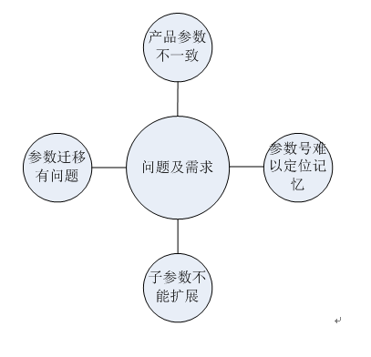
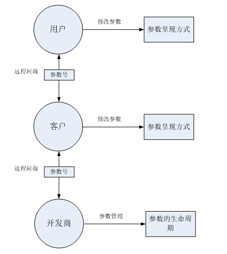

参数编号
======================
**NOTE:** 我们把：一部分从软件内部提取出来的，显示在界面上让用户可以进行交互操作的数据叫做参数。参数号是参数必不可少的一个属性,如果没有参数号，那就会缺失对参数
的管理。本文主要就参数编号的问题进行一些探究，并给出了一套切实可行的参数编号规范。
##问题及需求
我们在日常工作中，发现有这样一些针对参数号问题及需求：

1. 公司内各个产品组之间的参数号不统一，导致不同产品同一参数号会出现不同的参数，最终导致客户和我们的技术销售工程师使用不同产品的时候会极其不方便。

2. 公司内同一产品不同版本软件参数号对应参数不唯一，导致跨版本的参数迁移会出现严重问题。

3. 在没有设备的情况下，参数号的定位如何更快速准确，降低记忆的难度。

4. 某些参数有可能会有子参数的，并且这种子参数的个数是可能会有变化的。
 

##参数号作用
对于这些问题及需求的分析，应该从参数号的本质意义开始。对于不同对象，参数号的意义也是有所不同的。
终端用户：

* 与机床厂商或者开发商联系时确定参数。
  从种种迹象表明，终端用户关心的不是参数号本身，而是他们的常用参数以一个什么样的形式出现。[《用户参数方案》](docs/用户方案.md "title")

机床厂商（客户）层面：

* 方便记忆和寻找其想要修改的参数。
* 能够快速精确定位参数，减少与开发商之间的交流成本。

开发商层面：

* 能够系统地对参数进行管理，良好地控制参数的生命周期，解决组与组之间，历史版本与现有版本之间的参数问题。
* 能够快速精确定位参数，减少与客户之间的交流成本。

从图中我们可以看出，参数号的良性传递在沟通交流中起着关键性作用，所以他的唯一性，便捷性非常重要。

##参数号命名原则
为了满足不同对象对于参数号不同的本质需求，参数号的命名应该具有以下原则：

* 易于记忆（并不是简单的就是易于记忆的）
* 具有结构性（结构清晰但是复杂的并不是我们想要的）
* 具有一定的扩展性（参数随需求是需要扩展性的，但不代表可以随意修改）

##参数号方案分析
为了寻找一种最合适的参数号命名规则，我们对各种不同的参数号命名规则进行了一定的分析。

1.纯数字型

一些厂商，包括我司之前，都用纯数字来表示参数号。这种方案的优缺点我们在[《数字参数号.md》](docs/数字参数号.md "title")中作了详细阐述。

2.纯结构性英文

国外的一部分厂商，使用过纯结构性英文作为参数号。这种这种方案的优缺点我们在[《结构性英文参数号.md》](docs/结构性英文参数号.md "title")中作了详细阐述。

| 类型              | 优点           | 缺点  |
|: -------------- :|:-------------:| -----:|
| 纯数字           | 简洁           | 没有含义 |
| 结构性英文      | 含义明确        |  过于复杂 |

##Phoenix参数编号规则
针对以上方案中提出的这些问题，我们设计了一套参数命名的规则，尝试来解决这些问题。
我们首先考虑了以下几个问题:

* 首先考虑便于记忆的问题，必须是有意义的英文才能更好地让读者去记忆，所以必须有英文
* 全英文没有序列感，对于参数来说，会让人觉得杂乱，并且我们并不需要过多的英文含义去描述每一个细节，故需要数字序列
* 我们更加要控制参数的生命周期问题，因为这影响到版本问题。

由以上三点，我们提出了这样一套[《参数编号规范》](参数编号规范.md "参数标号规范")。

##新参数编号规范的优点

* 用有含义的缩写来表示小分类，便于记忆和快速定位参数。
* 数字个数充分考虑到了小类容量问题。
* 充分考虑了参数之间插入参数，扩展参数的问题
* 制定了严格的生命周期规则，很好地控制了内部协调和版本升级问题。