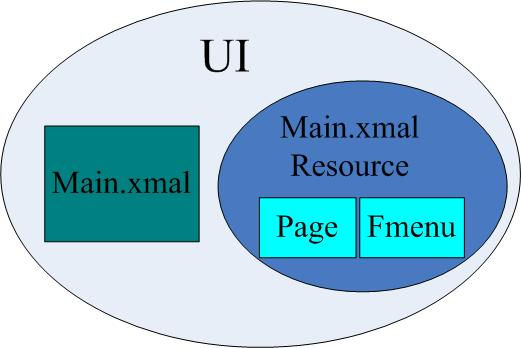

UI结构
==============================

**NOTE:** 本文先阐述UI的组成，然后对行为、触发器、 Action 概念做出解释，

##UI的组成



`UI` =布局文件 + 布局文件资源

`UI` 采用模块化设计，它由布局文件、布局文件资源构成。布局文件资源包括页面和F菜单。

页面通过控件给用户呈现数据，控件是数据的承载器，系统提供了很多的控件，根据作用分为以下三类。

第一类： Layout Controls（布局控件)

第二类： Item Controls （项目控件)

第三类： User Interaction Controls（用户交互控件)

布局控件负责用户界面的编排，项目文件负责一个控件与动态数据建立连接，用户交互控件负责功能的实现。

有了控件，接下来就是进行控件和数据的绑定，在介绍具体的绑定前，先简单描述下在绑定过程中需要用到的三个方法：触发器、操作和行为。

1）触发器（ `Trigger` ）： 是一种对象，该对象侦听特定条件（例如事件触发或属性设置为某个值），并调用一项或多项关联的 Actions 作为响应 

(1) Phoenix软件中常用的触发器：DataTrigger 、EventTrigger

2）操作（ `Action` ）:是只能“执行” 某些操作的对象

(1) 系统提供的操作：ChangePropertyAction、CallMethodAction。前者是常用的操作。

(2)Phoenix提供的操作：CallLuaFunctionAction

用法：
````
<ui:CallLuaFunctionAction Function="FunctionName" />
````
注：`ui` 是Phoenix的命名控件， `Function` 是操作CallLuaFunctionAction的属性，`FunctionName` 是所调用脚本的函数名。

3）行为（`Behavior`）：行为旨在封装了一些UI功能，从而可以不用编写代码就能够将其应用到元素上。从另一个角度来看，每个行为都为元素提供了一个服务，该服务涉及到监听几个不同事件并执行几个相关的操作。

(1)无任何外部通知的情况下， Behavior 也可以执行。

页面为人机交互提供了简便的方法。页面通过访问L表和G表两个表，显示用户所需信息。L表和G表存放供二次开发的数据。页面上的控件利用触发器、操作和行为三种方式进行数据的交互。

1.页面存放路径`Frame\.0Pages`


2.菜单存放路径`Frame\Menus`


3.布局文件存放路径`Frame\Main.xaml`


##界面的组装

`Main.xaml` 指定了页面和F菜单的路径，同时给出页面的名称和对应页面菜单的名称两个接口，页面名称用于外界访问界面或页面上的元素。页面菜单的名称用于在菜单文件中添加菜单内容。
````
<TabControl Style="{StaticResource HiddenTabControlStyle}">
	<TabItem Header="自动"  Name="Auto">
		<ui:XPage Name="CoorAutoPage"  Menu="Menu_Auto" Path="Frames\\Pages\\CoorAutoPage.xaml" />	
	</TabItem>
	<TabItem Header="参考点"  Name="Home">
		<ui:XPage Name="CoorHomePage"  Menu="Menu_Home" Path="Frames\\Pages\\CoorHomePage.xaml" />	
	</TabItem>
	<TabItem Header="手动"  Name="Jog">
		<ui:XPage Name="CoorJogPage"  Menu="Menu_Jog" Path="Frames\\Pages\\CoorJogPage.xaml" />
	</TabItem>
</TabControl>        
````
`Name` ：页面名称

`Menu` ：页面对应菜单的名称

`Path` ：页面文件的路径

在对应的F菜单脚本文件中配置菜单内容。

````
Menu_Home={
    F1=Item_HomedX,
	F2=Item_HomedY,
	F3=Item_HomedZ,
	F5=Item_HomedXY,
	F8=Item_HomedALL,
}; 
````
###控件的分类


##应用
讲这么多，也许大家还是不能理解这三个的作用，下面我用例子给大家说明。

Eg1.界面显示轴的机械坐标值。
````
<Label	x:Name="wc0"
		Grid.Row="2"
		Grid.Column="1"
		Content="0.000"
		FontWeight="Bold"
		ContentStringFormat="{}{0:F3}"
		Style="{StaticResource CoorContentLabel}" >
	<i:Interaction.Behaviors>
		<ui:DynamicBindingBehavior Path="Phoenix.G.Channels[0].Axes[0].WorkCoor" UpdateInterval="100" Property="Content"/>
	</i:Interaction.Behaviors>
</Label>     
````

所使用的控件为`Label`，它的属性`Content`的值是显示值。只要将该属性与数据的来源（寻址地址）绑定到一起，就能将X轴坐标值显示在界面上。

Eg2.界面显示端口的开关状态
````
<Image	x:Name="LightCloseState"
		Grid.Row="4"
		Grid.Column="5"
		Width="20"
		Height="10"
		HorizontalAlignment="Left"
		VerticalAlignment="Center">
	<i:Interaction.Behaviors>
		<ui:DynamicBindingBehavior Path="Phoenix.G.Lambda.Y02" UpdateInterval="100" Property="Tag"/>
	</i:Interaction.Behaviors>
	<i:Interaction.Triggers>
		<ei:DataTrigger Binding="{Binding Path=Tag,ElementName=LightCloseState}" Comparison="Equal" Value="true">
			<ei:ChangePropertyAction PropertyName="Source" TargetObject="{Binding ElementName=LightCloseState}" Value="{ui:PathBinding Frames\\Pages\\Resources\\SketchLightOn.bmp}" />
		</ei:DataTrigger>
		<ei:DataTrigger Binding="{Binding Path=Tag,ElementName=LightCloseState}" Comparison="Equal" Value="false">
			<ei:ChangePropertyAction PropertyName="Source" TargetObject="{Binding ElementName=LightCloseState}" Value="{ui:PathBinding Frames\\Pages\\Resources\\SketchLightOff.bmp}" />
		</ei:DataTrigger>
	</i:Interaction.Triggers>
</Image>     
````

所使用的控件：`Image`。控件涉及的操作：行为、触发器、Action。

行为中将端口地址与控件的`Tag`属性绑定（`Tag`属性是所有控件的自定义扩展属性），它会将端口的状态值传递给`Tag`。触发器中采用的是数据触发器，当`Tag`的值与`Value`相等时，就会执行“操作”。

PS：已经安装`VS2010`和`MSDN`的同事，可以通过软件内部的帮助文档直接查询以下相关资料。没有安装的通过控件的属性和事件信息查询：

https://msdn.microsoft.com/zh-cn/library/ms752324.aspx

行为和触发器相关信息：

https://msdn.microsoft.com/zh-cn/library/system.windows.interactivity(v=expression.40).aspx 